# Resume Parser
## 1. Overview

This project implements a pluggable and extensible Resume Parsing Framework in Python. The system extracts structured information from resumes, specifically:
- Name
- Email
- Skills

### Design Highlights
- **Separation of Concerns**: File parsing and field extraction are handled independently, ensuring clarity and maintainability.
- **Pluggable Components**: The framework allows parsers and extractors to be easily swapped without modifying the core logic.
*For example: A different parser (e.g., TXTParser) can replace PDFParser or WordParser as well as a different extraction strategy (e.g., rule-based or LLM-based) can replace an existing extractor*
- **Extensible Architecture**:
New file formats or extraction strategies can be added by implementing existing interfaces (FileParser, FieldExtractor) without changing the framework code.

## 2. Features
Supported file formats are PDF (.pdf) and Word (.docx).

### Field-specific extraction strategies:
- Name → LLM-based (OpenAI)
- Email → Regex-based
- Skills → LLM-based (OpenAI)

## 3. Architecture
<<<<<<< HEAD



## 4. Project Structure
```bash
resume_parser/
│
├── parsers/
│ ├── base_parser.py
│ ├── pdf_parser.py
│ ├── word_parser.py
│
├── extractors/
│ ├── base_extractor.py
│ ├── name_extractor.py
│ ├── email_extractor.py
│ ├── skills_extractor.py
│
├── models/
│ └── resume_data.py
│
├── core/
│ ├── resume_extractor.py
│ └── framework.py
│
├── tests/
├── utils/logger.py
│
├── resume_parser.py
├── requirements.txt
└── README.md
```

## 5. Set Up and Installation

### Prerequisites

- Python 3.10+
- `pip`
- OpenAI API key

### Step 1: Create a virtual environment

#### Windows
```bash
python -m venv .venv
.venv\Scripts\activate
```

#### macOS / Linux
```bash
python -m venv .venv
source .venv/bin/activate
```

### Step 2: Install dependencies

```bash
pip install -r requirements.txt
```

### Step 3: Set credentials in `.env`

- Copy .env.example as .env
- Replace with your credentials

---

## 6. Usage

`python resume_parser.py <file_path>`
- Example: `python resume_parser.py sample_resume.pdf`

Output:
```json
{
  "name": "Jane Doe",

  "email": "jane.doe@gmail.com",
  
  "skills": ["Python", "Machine Learning", "SQL"]
}
<<<<<<< HEAD


## 7. Run the tests

Run the following command:

```bash
pytest -q tests
```

**Note:**

- The tests use mocks and stubs so they do not call real OpenAI services.
- This keeps the suite fast, deterministic, and suitable for local development as well as CI.
=======
```
>>>>>>> ae6cc8d613592eb072f81c8e75a7b2bef59bace6
